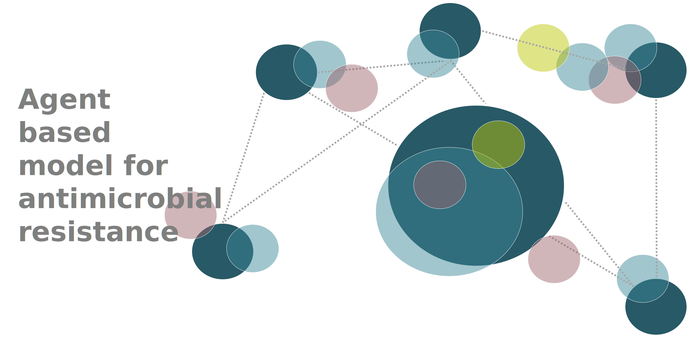

# ABM_AMRO

Agent Based Model repository for antimicrobial resistance



## Setup

You can install the package via `pip`:

```bash
pip install git+https://github.com/RodrigoZepeda/ABM_AMRO
```

To install the development version:
```bash
pip install git+https://github.com/RodrigoZepeda/ABM_AMRO@dev
```

You can also download the repository and build locally with:
```bash
python setup.py build_ext -i
```

### Troubleshooting installation

#### OSX

Mac users require an installation of `libomp`. This can be done with homebrew via 
```bash
brew install libomp
```

If this is the first time you hear of homebrew you can check [this tutorial](https://www.digitalocean.com/community/tutorials/how-to-install-and-use-homebrew-on-macos).

#### Ubuntu

Linux users require an installation of `openmp`. In Ubuntu you can do it with: 
```bash
apt install libomp-dev
```

#### Windows (version >= 8 and 64 bit)

> :warning: I don't have Windows. I haven't tested it on Windows then. 

Apparently, you might need a `C++` compiler different from the native Windows one. You can download one
following [this instructions](https://code.visualstudio.com/docs/cpp/config-mingw#_prerequisites). If you are using R 
with `Rtools` you probably already have one (try `gcc --help`). 

#### Setting your compiler path for installation

You might have more than one compiler in your computer. The suggested ones are `gcc` for
Linux and Windows and `clang` for OSX. You can install using your
favourite compiler by passing the flag `CC` before pip:

```bash
CC=/path/to/your/gcc pip install git+https://github.com/RodrigoZepeda/ABM_AMRO
```

To find the path of your compiler you can do `where gcc` (or the compiler you want)
in Windows or `which gcc` (or the compiler you want) in Unix.

#### Request support
You can raise an issue to report installation issues. Make sure to include
the results of:
```bash
pip install --verbose git+https://github.com/RodrigoZepeda/ABM_AMRO
```

## Tutorials 

Go to the `tutorial/` folder for tutorials

## Contributing 

Go to **How to contribute** to learn more on the package's philosophy. 
